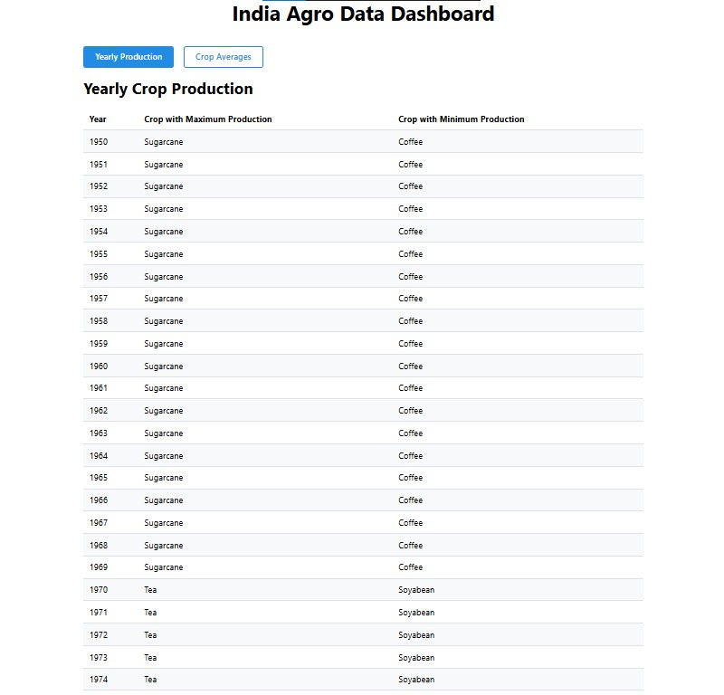
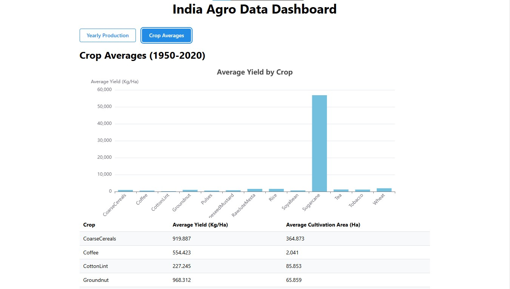

# Agro Dataset Aggregation with React + TypeScript + Vite

This project is a web application built with React, TypeScript, and Vite, styled using Mantine. It processes agricultural data from 1950 to 2020 to display aggregated crop production and average statistics in interactive tables.

## Features
- Displays **Yearly Crop Production** (maximum and minimum production for each year).
- Displays **Crop Averages** (average yield and cultivation area for each crop between 1950–2020) in Bar Chart using Apache Echarts.
- Styled with Mantine for a clean and responsive design.
- Buttons allow switching between different datasets.

---

## Prerequisites
Make sure you have the following installed on your system:
- [Node.js](https://nodejs.org/) (>= 16.0.0)
- [npm](https://www.npmjs.com/) or [yarn](https://yarnpkg.com/)

---

## Setup Instructions

1. **Clone the Repository**
   ```bash
   git clone https://github.com/hemantsoni23/sde_assignment.git
   cd sde_assignment
   ```

2. **Install Dependencies**
   ```bash
   npm install
   ```
   or if using yarn:
   ```bash
   yarn install
   ```

3. **Start the Development Server**
   ```bash
   npm run dev
   ```
   or:
   ```bash
   yarn dev
   ```

4. Open the application in your browser at [http://localhost:5173](http://localhost:5173).

---

## Build Instructions

To create a production build of the application:

1. **Run Build Command**
   ```bash
   npm run build
   ```
   or:
   ```bash
   yarn build
   ```

2. **Preview the Build**
   ```bash
   npm run preview
   ```
   or:
   ```bash
   yarn preview
   ```
---

## Project Structure

```
src/
├── components/
│   └── BarChart.tsx
├── assets/
│   └── Manufac_India_Agro_Dataset.json # Dataset used in the application
├── lib/
│   └── utils.ts                       # Data aggregation utilities
├── App.tsx                            # Main app component to show data and table
└── main.tsx                           # Main application entry point
```

## Screenshots

### 1. Yearly Crop Production Table


### 2. Crop Averages Table

